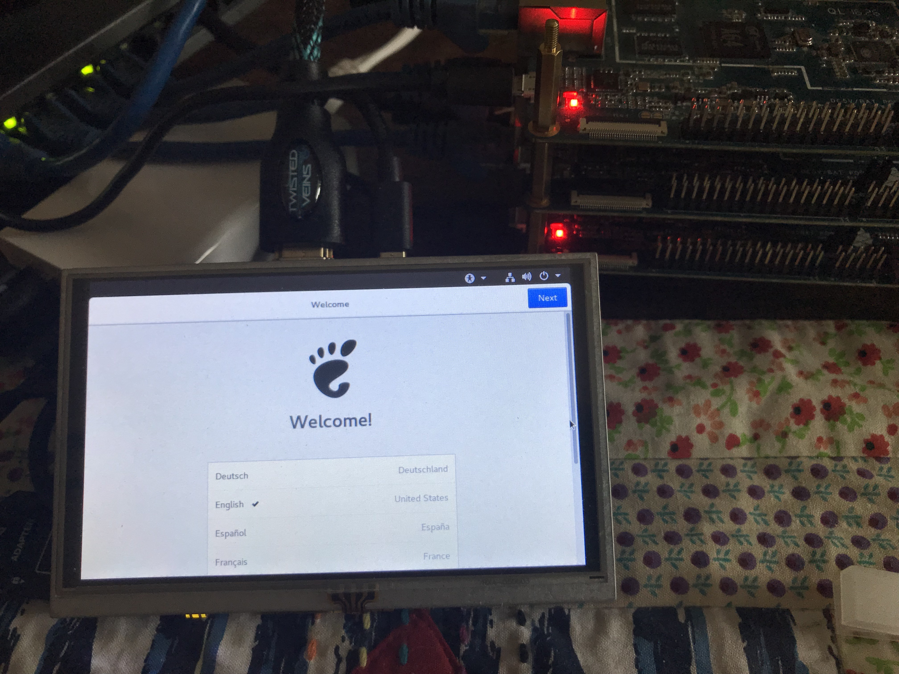

# CentOS for Pine64
## Summary
Flashes a MicroSD Card with a Centos RootFS and an Armbian UBoot&amp;Kernel for a Pine64 board

## Prerequisites
Running Linux distribution with MicroSD card inserted

## Use an existing release
You can use any one of the releases attached to this project and directly flash them onto the MicroSD
card using the nice Etcher GUI tool, or if you feel more adventures you can use the `dd` tool. Make sure you use the correct device name for the MicroSD card or you can loose all the data on the device.

```
dd bs=1MB if=<release.img> of=/dev/<device_name>
```

## Create your own distribution from the Armbian and CentOS sources
The install.sh uses an [Armbian](https://www.armbian.com/pine64/) release that was copied from

https://dl.armbian.com/pine64/nightly/

and a Centos 7 RootFS copied from 

http://vault.centos.org/altarch/7.4.1708/isos/aarch64/

The Armbian distribution was decompressed before committing to git so that that the image can referenced.
To create a bootable MicroSD card with CentOS 7 simply run:

```
bash install.sh
```

The whole process takes about 5 minutes or so. After is completes, boot using the new card and login with root/centos and finish the install using

```
bash /root/finish-centos-install.sh
```

This will amoung other things prompt you to change the root password.


